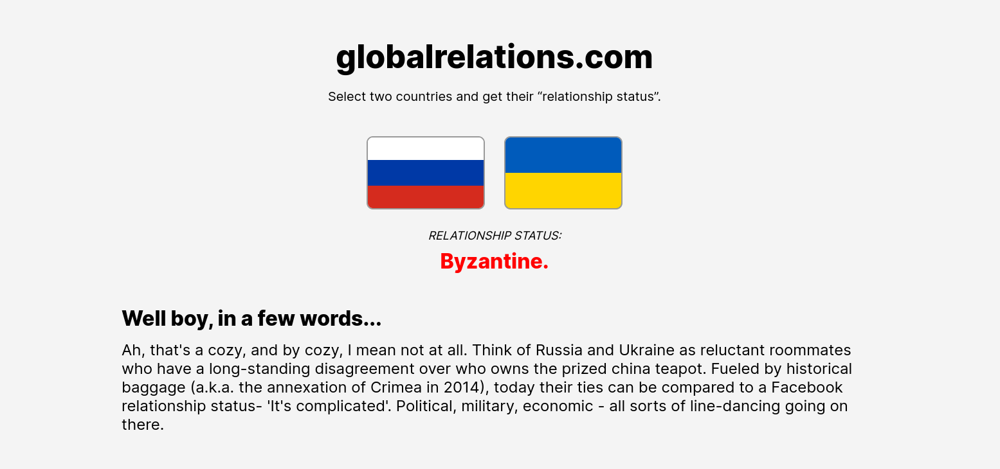

# globalrelations.com API



This repository hosts an innovative API that allows users to explore and understand the relationships between two countries through a powerful integration with the ChatGPT API. The API provides a simple and intuitive interface, enabling developers and end-users to access detailed information about the relationship between the specified countries.

**Key Features:**
1. **Relationship Query:** Users can provide the names of two countries as parameters to the API. The API then leverages ChatGPT's advanced natural language processing capabilities to generate meaningful insights into the relationship between these countries.
2. **Integration with ChatGPT:** The API utilizes ChatGPT's powerful conversational ability to extract contextually relevant information about interactions between the countries. This includes historical data, diplomatic agreements, trade relations, significant events, and more.

**Local setup:**
Requirements:
- Python 3.9+

``ssh
python3 -m venv ./venv
source ./venv/bin/activate
pip install -r requirements.txt
```

**How to Contribute:**
This project is currently not accepting contributions. However, contributions will be welcomed soon. Please stay tuned for updates on when the repository will start accepting contributions. Feel free to star the repository to show your interest and stay informed about future developments.

**Implementation Notes:**
- It is recommended to use virtual environments for dependency installation and running the application.

Explore the richness of relationships between countries with this innovative API, providing an informative and engaging experience for users.